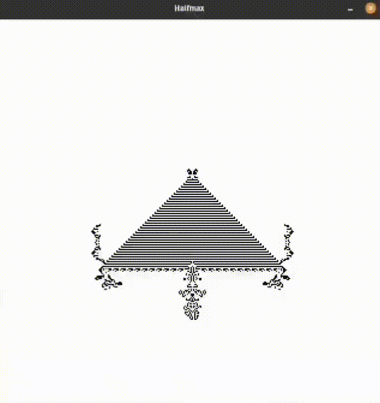
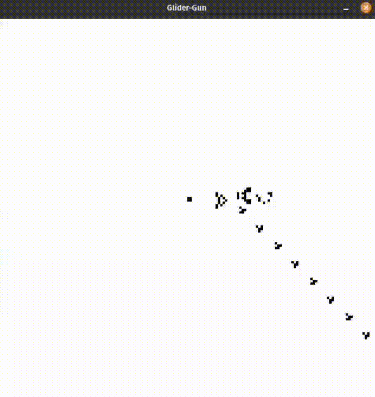

# game-of-life
A game of life🔬 simulator on an infinite♾️ plane

<p float="right">
  <a href="https://github.com/adam-mcdaniel/game-of-life/blob/main/examples/random.rs"></a>
  <a href="https://github.com/adam-mcdaniel/game-of-life/blob/main/examples/halfmax.rs"></a>
</p>

***NOTE: This is a toy project! I did this just for fun, not as a packaged product.***

## About the Author

I'm a *bored* sophomore in college working on projects to fill the time. If you enjoy my work, consider supporting me by buying me a coffee! 

<a href="https://www.buymeacoffee.com/adam.mcdaniel" target="_blank">
  
</a>

## What possessed me to write yet another Game of Life🦠 simulator?

<div align="left">
<a href="https://github.com/adam-mcdaniel/game-of-life/blob/main/examples/glider-gun.rs"></a>
Everyone who has learned to program at this point <a href="https://github.com/search?q=game+of+life&type=code">has probably written a Game of Life simulator</a>; it's a bit of a rite of passage, like a more sophisticated "Hello World!" program. For those of you who haven't seen the Game of Life yet, it's a <a href="https://en.wikipedia.org/wiki/Cellular_automaton">cellular automata</a> performed on a 2D plane with the following rules:

<h4>Rules</h4>
<ol>
<li>Any live cell with fewer than two live neighbours dies, as if by starvation.</li>
<li>Any live cell with two or three live neighbours lives on to the next generation.</li>
<li>Any live cell with more than three live neighbours dies, as if by overpopulation.</li>
<li>Any dead cell with exactly three live neighbours becomes a live cell, as if by reproduction.</li>
</ol>

<i><b>However</i></b>, most people just get the minimal, barebones simulation working on a glider or a few other patterns before finishing up the project, and more importantly, we only ever learn how to implement the Game on a statically sized grid. How do the more complicated simulators on the internet support <i><b>theoretically infinitely sized worlds🧫???</i></b>

Thinking about this got me curious, so I took a stab at it myself and I think I did an okay job!
</div>

## How does it work?

The key to the solution is expressed in the wording of the problem itself: to make an implementation agnostic of infinitely sized worlds, the implementation *must not depend on the world's size*.

So what does that mean in practice? Well, it means that any implementation using statically allocated arrays for the world is already out of the running. But what about dynamically sized arrays? Although, yes, in theory these are possible, they would be **incredibly** inefficient. Every time a glider moved beyond a corner of the world, the program would have to allocate a new row, *and* a new column: which would compound as the glider keeps going! Your program would ***very quickly*** run out of memory, unless it could deallocate parts of the grid it wasn't using, which would take quite a bit of time on its own.

For some, it might be painfully obvious that the solution is to *only* store the live cells mapped from their position. So for a glider traversing the entire world for an infinitely long, your program only every stores data for ***5 cells at once!*** This has the added benefit that this makes it very simple to only ever consider cells which are already neighbors of live cells.

The entire algorithm works as follows for each iteration:
1. For every live cell, if it is overcrowded *(>3 neighbors)* or starving *(<2 neighbors)*, remove it from the next iteration.
2. Additionally, for every neighboring position of that cell *(regardless of whether it was removed)*:
   3. If the position has already been considered, skip the following steps. Otherwise, add the position to the set of previously considered positions.
   4. If the position is overcrowded or starving, remove the cell at that position from the next iteration *(if it exists)*.
   5. If the position has ***exactly three live neighbors, however***, insert a cell at that position in the next iteration.
6. Voila! You have the next iteration of the world!

## Example Code

Here is some example code using the simulator!

```rs
// A simulation of a glider
use game_of_life::World;

fn main() {
    let world = World::grid([
         [1, 1, 1],
         [0, 0, 1],
         [0, 1, 0]
    ]);
    for iteration in world {
        println!("{}", iteration);
    }
}
```

This example demonstrates the sim's ability to handle dozens of thousands of cells at once!

```rs
// A simulation of the Halfmax breeder
use game_of_life::World;
use std::str::FromStr;

fn main() {
    let world = World::from_str(include_str!("examples/halfmax.txt")).unwrap();
    for iteration in world {
        println!("{}", iteration);
    }
}
```

## Usage

To run, you must download Rust from [here](https://www.rust-lang.org/).

```bash
# Clone the repo and run from source
git clone https://github.com/adam-mcdaniel/game-of-life
cd game-of-life
cargo run --example random --release
```
